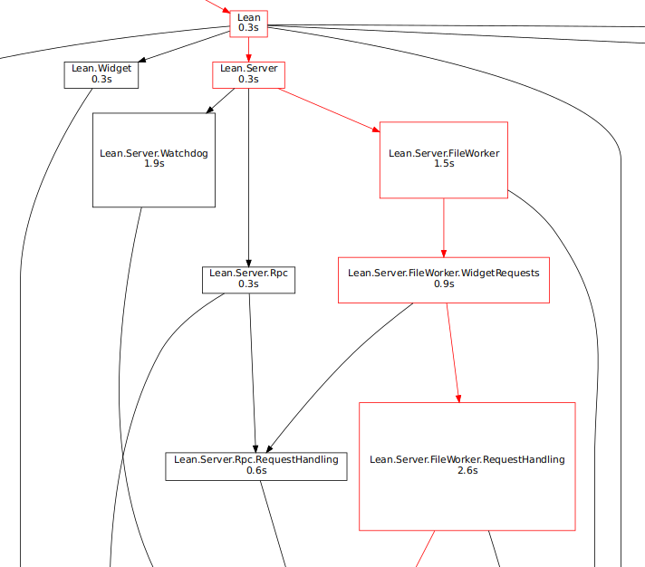
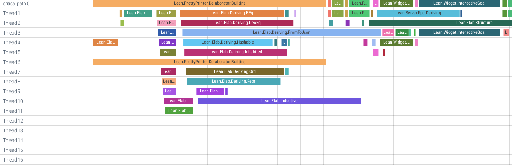

# Nixprof

Nixprof is a tool for profiling and visualizing build times spent on a Nix build graph.

## Installation

Nixprof **requires Nix 2.4+** for its `internal-json` logging format and some `nix` command functionality

...so we may as well use flakes

``` sh
nix shell github:Kha/nixprof
```

## Usage

First you need to record Nix building the desired graph once:

``` sh
nixprof record nix-build ...  # or `nix build ...`
```
This will save the Nix log annotated with timestamps in `nixprof.log`.
You can use `-o` to select a different output filename, which I like to use to record the specific commit and number of cores:
``` sh
nixprof record -o $(git rev-parse @).json.16 nix build .#lean-all --option max-jobs 16
```

Make sure that the parts you are interested in are actually (re)built (and not fetched from a substituter), e.g. by introducing trivial changes in the source.
``` sh
echo "-- $(date)" >> src/Init/Prelude.lean
```

Now you can use `nixprof report` on that file to create various reports:

```
Usage: nixprof report [OPTIONS]

Options:
  -i, --in FILENAME             log input filename
  -t, --tred                    remove transitive edges (can speed up and
                                declutter dot graph display)
  -p, --print-crit-path         print critical (longest) path
  -a, --print-avg-crit          print average contribution to critical paths
  -s, --print-sim-times         print simulated build times by processor count
                                up to optimal count
  -d, --save-dot FILENAME       write dot graph to file
  -c, --save-chrome-trace TEXT  write `chrome://tracing`'s `trace_event`
                                format to file. When combined with `-s`, also
                                write simulated traces to files with processor
                                count as suffix.
  --all                         print all analyses, write all output files
  --merge-into-pred TEXT        for each derivation with exactly one
                                predecessor (dependency) and whose name
                                matches the given regex, merge build time and
                                dependents into that predecessor
  --merge-into-succ TEXT        for each derivation with exactly one successor
                                (dependent) and whose name matches the given
                                regex, merge build time and dependencies into
                                that successor
  --help                        Show this message and exit.Usage: nixprof report [OPTIONS]
```
NOTE: In addition to the input log file, `report` will also use `nix path-info --json` to recover the dependency edges, so the build results still need to be available in the Nix store when running Nixprof.

The following examples are from a flake build of [leanprover/lean4](https://github.com/leanprover/lean4).

### Critical Path

The *critical path* answers the question "Given sufficient parallelism, what is the chain of build steps that determines the total build time?"

``` sh
$ nixprof report -p
Critical path
  time [s]          [cum]          drv
----------  ----  -------  ------  ---------------------------------------------
       1.6  1.3%      1.6    1.3%  Init.Prelude
       3.6  2.9%      5.2    4.3%  Init.Notation
       0.1  0.1%      5.3    4.3%  Init.SizeOf
       1.1  0.9%      6.4    5.3%  Init.Core
       0.2  0.2%      6.6    5.4%  Init.SimpLemmas
       0.7  0.6%      7.4    6.0%  Init.Data.Nat.Basic
       0.2  0.2%      7.6    6.2%  Init.WF
       0.2  0.2%      7.8    6.4%  Init.Data.Nat.Div
       0.1  0.1%      7.9    6.5%  Init.Data.Nat.Bitwise
       0.2  0.2%      8.1    6.7%  Init.Data.Fin.Basic
       0.4  0.3%      8.5    7.0%  Init.Data.UInt
       0.1  0.1%      8.6    7.1%  Init.Data.Char.Basic
       0.6  0.5%      9.2    7.6%  Init.Data.String.Basic
       0.5  0.4%      9.7    8.0%  Init.Data.Format.Basic
       0.4  0.3%     10.1    8.2%  Init.Data.Repr
       0.2  0.2%     10.3    8.4%  Init.Data.ToString.Basic
       0.1  0.1%     10.4    8.5%  Init.Util
       1.3  1.1%     11.7    9.6%  Init.Data.Array.Basic
       2.1  1.7%     13.8   11.3%  Init.Meta
       0.1  0.1%     13.9   11.4%  Init.Data.ToString.Macro
       0.1  0.1%     13.9   11.4%  Init.Data.ToString
       1.4  1.2%     15.4   12.6%  Init.NotationExtra
       0.3  0.2%     15.6   12.8%  Init.Classical
       0.2  0.2%     15.8   13.0%  Init.System.ST
       0.9  0.8%     16.7   13.7%  Init.System.IO
       0.1  0.1%     16.9   13.8%  Init.Control.StateRef
       1.3  1.1%     18.2   14.9%  Init.Control.Lawful
       0.2  0.2%     18.4   15.1%  Init.Control.StateCps
       0.1  0.1%     18.5   15.2%  Init.Control
       0.1  0.1%     18.6   15.3%  Init
       0.8  0.6%     19.4   15.9%  Std.Data.AssocList
       0.7  0.6%     20.1   16.5%  Std.Data.HashMap
       0.6  0.5%     20.7   16.9%  Lean.Data.SMap
       0.4  0.3%     21.0   17.2%  Lean.Data.SSet
       0.5  0.4%     21.5   17.6%  Lean.Data.Name
       0.4  0.3%     21.9   18.0%  Lean.Data.KVMap
       0.4  0.4%     22.4   18.3%  Lean.Data.Options
       0.2  0.2%     22.6   18.5%  Lean.Data.Format
       0.4  0.3%     23.0   18.8%  Lean.Hygiene
       1.2  0.9%     24.1   19.8%  Lean.Level
       2.3  1.9%     26.5   21.7%  Lean.Expr
       1.3  1.1%     27.8   22.8%  Lean.LocalContext
       4.2  3.4%     32.0   26.3%  Lean.MetavarContext
       0.2  0.2%     32.2   26.4%  Lean.Util.PPExt
       0.8  0.6%     33.0   27.1%  Lean.Message
       0.3  0.2%     33.3   27.3%  Lean.Exception
       0.8  0.7%     34.1   28.0%  Lean.MonadEnv
       0.6  0.5%     34.7   28.4%  Lean.Util.Trace
       0.5  0.4%     35.2   28.9%  Lean.CoreM
       1.1  0.9%     36.3   29.8%  Lean.Attributes
       0.7  0.6%     37.0   30.3%  Lean.Class
       3.6  2.9%     40.6   33.3%  Lean.Meta.Basic
       2.9  2.3%     43.4   35.6%  Lean.Meta.InferType
       3.8  3.1%     47.2   38.7%  Lean.Meta.LevelDefEq
       3.5  2.8%     50.7   41.6%  Lean.Meta.WHNF
       1.7  1.4%     52.4   43.0%  Lean.Meta.DiscrTree
       0.8  0.6%     53.2   43.6%  Lean.Meta.Instances
       2.8  2.3%     56.0   45.9%  Lean.Meta.SynthInstance
       2.1  1.7%     58.1   47.6%  Lean.Meta.AppBuilder
       1.1  0.9%     59.2   48.5%  Lean.Meta.Offset
       7.2  5.9%     66.3   54.4%  Lean.Meta.ExprDefEq
       2.4  2.0%     68.7   56.3%  Lean.Meta.RecursorInfo
       2.4  2.0%     71.1   58.3%  Lean.Meta.Tactic.Induction
       2.6  2.1%     73.7   60.4%  Lean.Meta.Tactic.Cases
       1.3  1.1%     75.0   61.5%  Lean.Meta.Tactic.Contradiction
       5.3  4.3%     80.3   65.8%  Lean.Meta.Match.Match
       3.4  2.8%     83.7   68.6%  Lean.Meta.Match.MatchEqs
       1.2  1.0%     84.9   69.6%  Lean.Meta.Tactic.Split
       0.3  0.3%     85.2   69.9%  Lean.Meta.Tactic
       5.6  4.6%     90.9   74.5%  Lean.Meta.IndPredBelow
       0.5  0.4%     91.4   74.9%  Lean.Meta
       8.3  6.8%     99.7   81.7%  Lean.PrettyPrinter.Delaborator.TopDownAnalyze
       1.8  1.5%    101.5   83.2%  Lean.PrettyPrinter.Delaborator.Basic
       7.2  5.9%    108.7   89.1%  Lean.PrettyPrinter.Delaborator.Builtins
       0.2  0.2%    108.9   89.3%  Lean.PrettyPrinter.Delaborator
       0.4  0.4%    109.3   89.7%  Lean.PrettyPrinter
       0.7  0.6%    110.1   90.2%  Lean.Widget.InteractiveCode
       1.7  1.4%    111.8   91.7%  Lean.Widget.InteractiveGoal
       1.2  1.0%    113.0   92.6%  Lean.Widget.InteractiveDiagnostic
       0.5  0.4%    113.5   93.1%  Lean.Server.Snapshots
       0.4  0.3%    113.9   93.4%  Lean.Server.FileWorker.Utils
       0.5  0.4%    114.5   93.8%  Lean.Server.Requests
       2.6  2.1%    117.0   96.0%  Lean.Server.FileWorker.RequestHandling
       0.9  0.8%    117.9   96.7%  Lean.Server.FileWorker.WidgetRequests
       1.5  1.3%    119.5   98.0%  Lean.Server.FileWorker
       0.3  0.2%    119.7   98.2%  Lean.Server
       0.3  0.3%    120.1   98.4%  Lean
       0.0  0.0%    120.1   98.5%  Lean-cc
       0.1  0.1%    120.2   98.5%  Lean-lib
       1.0  0.8%    121.1   99.3%  leanshared
       0.3  0.2%    121.4   99.6%  leanc
       0.1  0.0%    121.5   99.6%  leanc
       0.3  0.3%    121.8   99.9%  lean
       0.1  0.1%    121.9   99.9%  lean-stage1
       0.1  0.1%    122.0  100.0%  lean
```

This chain gives you an idea of how to speed up the build by speeding up or avoiding an element of it.
However, there is no guarantee that this path is still the critical one after optimization, so the speedup might be less than expected.

### Average Contribution to Critical Paths

The critical path demonstrates contributions to the total build time, but what about partial rebuilds?
If we assume that the sources of every derivation in the build graph are equally likely to be modified, we can compute the average contribution to a partial rebuild by averaging contributions to the critical paths starting from *each* derivation.

``` sh
$ nixprof report -a
Average contribution to critical paths
  time [s]          [cum]          drv
----------  ----  -------  ------  ---------------------------------------------
       1.9  8.1%      1.9    8.1%  Lean.PrettyPrinter.Delaborator.TopDownAnalyze
       1.7  7.1%      3.6   15.2%  Lean.PrettyPrinter.Delaborator.Builtins
       1.2  5.1%      4.8   20.2%  Lean.Meta.IndPredBelow
       1.1  4.7%      5.9   25.0%  Lean.Meta.ExprDefEq
       1.0  4.2%      6.9   29.2%  Lean.Meta.Match.Match
       0.9  3.6%      7.7   32.8%  leanshared
       0.7  2.9%      8.4   35.7%  Lean.Meta.Match.MatchEqs
       0.7  2.8%      9.0   38.5%  Lean.Server.FileWorker.RequestHandling
       0.5  2.2%      9.6   40.7%  Lean.Meta.LevelDefEq
       0.5  2.1%     10.1   42.9%  Lean.Meta.WHNF
       0.5  2.0%     10.5   44.9%  Lean.Meta.Basic
       0.4  1.8%     11.0   46.7%  Lean.Meta.Tactic.Cases
       0.4  1.8%     11.4   48.5%  Lean.MetavarContext
       0.4  1.8%     11.8   50.3%  Lean.PrettyPrinter.Delaborator.Basic
       0.4  1.8%     12.2   52.1%  Lean.Widget.InteractiveGoal
       0.4  1.8%     12.6   53.9%  Lean.Meta.SynthInstance
       0.4  1.7%     13.0   55.6%  Lean.Server.FileWorker
       0.4  1.6%     13.4   57.2%  Lean.Meta.Tactic.Induction
       0.4  1.6%     13.8   58.8%  Lean.Meta.InferType
       0.4  1.6%     14.2   60.4%  Lean.Meta.RecursorInfo
       0.4  1.5%     14.5   62.0%  Lean.Elab.Structure
       0.3  1.4%     14.9   63.4%  Lean.Meta.AppBuilder
       0.3  1.3%     15.2   64.6%  Lean.Widget.InteractiveDiagnostic
       0.3  1.3%     15.5   65.9%  Lean.Elab.MutualDef
       0.3  1.3%     15.8   67.1%  lean
       0.3  1.2%     16.0   68.3%  Lean.Elab.Inductive
       0.3  1.1%     16.3   69.4%  leanc
       0.3  1.1%     16.6   70.5%  Lean.Elab.Term
       0.2  1.0%     16.8   71.6%  Lean.Meta.DiscrTree
       0.2  1.0%     17.0   72.6%  Lean.Meta.Tactic.Split
       0.2  1.0%     17.3   73.6%  Lean.Server.FileWorker.WidgetRequests
       0.2  1.0%     17.5   74.6%  Lean.Expr
       0.2  1.0%     17.7   75.6%  Lean.Meta.Tactic.Contradiction
       0.2  0.8%     17.9   76.3%  Lean.Elab.Binders
       0.2  0.7%     18.1   77.1%  Lean.Widget.InteractiveCode
       0.2  0.7%     18.2   77.8%  Lean.Meta.Offset
       0.2  0.7%     18.4   78.4%  Lean.Elab.Command
       0.1  0.6%     18.6   79.1%  Lean.Elab.PreDefinition.Structural.IndPred
       0.1  0.6%     18.7   79.6%  Lean.Attributes
       0.1  0.6%     18.8   80.2%  Lean.Server.Requests
       0.1  0.6%     19.0   80.8%  Lean
       0.1  0.6%     19.1   81.4%  Lean.Server.Snapshots
       0.1  0.6%     19.2   82.0%  Lean.LocalContext
       0.1  0.6%     19.4   82.5%  Lake.Build.Package
       0.1  0.5%     19.5   83.0%  Lean.Elab.PreDefinition.Main
       0.1  0.5%     19.6   83.6%  Lean.Elab.Declaration
       0.1  0.5%     19.7   84.1%  Lean.Meta.Instances
       0.1  0.5%     19.8   84.5%  Lean.Meta
       0.1  0.5%     19.9   85.0%  Lean.Level
       0.1  0.5%     20.1   85.5%  Lean.Elab.Tactic.Basic
       0.1  0.4%     20.2   85.9%  Lean.Elab.SyntheticMVars
       0.1  0.4%     20.3   86.4%  Lean.PrettyPrinter
       0.1  0.4%     20.4   86.8%  Lean.Server.FileWorker.Utils
       0.1  0.4%     20.5   87.2%  Lean.MonadEnv
       0.1  0.4%     20.5   87.6%  Lean.Message
       0.1  0.4%     20.6   87.9%  lean-stage1
       0.1  0.4%     20.7   88.3%  Lean.Elab.PreDefinition.Structural.Main
       0.1  0.4%     20.8   88.6%  Lean.Parser.Term
       0.1  0.3%     20.9   89.0%  Lean.Class
       0.1  0.3%     21.0   89.3%  Lake.CLI.Main
       0.1  0.3%     21.0   89.6%  Lean-lib
       0.1  0.3%     21.1   90.0%  Lean.Parser.Command
       0.1  0.3%     21.2   90.3%  Lean.Meta.Tactic
       0.1  0.3%     21.3   90.6%  Lean.Server
       0.1  0.3%     21.3   90.9%  lean
       0.1  0.3%     21.4   91.1%  Lean.Elab.PreDefinition.Basic
       0.1  0.3%     21.4   91.4%  Lean.Util.Trace
       0.1  0.3%     21.5   91.7%  Std.Data.AssocList
       0.1  0.3%     21.6   91.9%  Lean.Elab.DefView
       0.1  0.3%     21.6   92.2%  Lean.CoreM
       0.1  0.3%     21.7   92.5%  Init.Control.Lawful
       0.1  0.2%     21.8   92.7%  Std.Data.HashMap
       0.1  0.2%     21.8   92.9%  Init.Meta
       0.1  0.2%     21.9   93.2%  Lean.PrettyPrinter.Delaborator
       0.1  0.2%     21.9   93.4%  leanc
       0.1  0.2%     22.0   93.6%  Lean.Parser.Syntax
       0.0  0.0%     23.5  100.0%  [total]
```

Note: the table is sorted by descending time, with items < 0.05s omitted.

This output means that, since in this build graph most derivations correspond to a single source file, if I change a random file, 1.9s out of 23.5s are spent on rebuilding `Lean.PrettyPrinter.Delaborator.TopDownAnalyze` on average.

### Simulated Build Parallelism

The above analyses are independent of the number of available cores or parallel jobs configured in Nix, or how many of them were used when recording; you can think of them assuming an infinitely parallel build.
Nixprof can give you an idea of the parallelism of your build by *simulating* build times for a given number of parallel jobs based on the recorded build graph and times.

```sh
$ nixprof report -s
Simulated build times by processor count up optimal power of two
  #CPUs    time [s]    CPU% [avg]
-------  ----------  ------------
      1  601.733758          100%
      2  310.011294          194%
      4  178.041022          338%
      8  130.940682          460%
     16  123.067779          489%
     32  121.965845          493%
```

In this case, while the simulated build time continuously improves up to a number of 32 cores, we see that after 8 cores there is barely any improvement.
And even then, only slightly more than half the cores are actually in use on average.

Caveats:
* We assume all build steps are single-threaded.
* There is no accounting of parallelism overhead.
* The simulation is a simple first-fit scheduling algorithm: whenever a task is finished, we schedule any ready dependencies on any free cores, using the order of the recorded build as a tie-breaker.
  This might not be the optimal scheduling, but as much is true for any real build.

### Dot Graph

``` sh
$ nixprof report -d --tred --merge-into-succ '-cc|-depRoot'  # see above for flags
# display e.g. using `xdot`
$ nix run nixpkgs#xdot nixprof.dot
# or convert to e.g. svg
$ nix shell nixpkgs#graphviz -c dot -Tsvg < nixprof.dot > nixprof.svg
```

[](doc/dot.svg)

Box heights are scaled by build time.
The critical path is shown in red.
My creativity was exhausted after that.

### Chrome Trace

``` sh
$ nixprof report -c nixprof.trace_event
```

Display in Chrome's `chrome://tracing` or on [perfetto.dev](https://ui.perfetto.dev) in any browser:



This trace shows the actual start and end times of each build step, though the assignment to threads is simulated using the same scheduling algorithm as described above.
Gaps in the trace, especially at the beginning, show Nix being busy with other stuff than strictly building.

---

*...jack of all trades, professor of nix*
